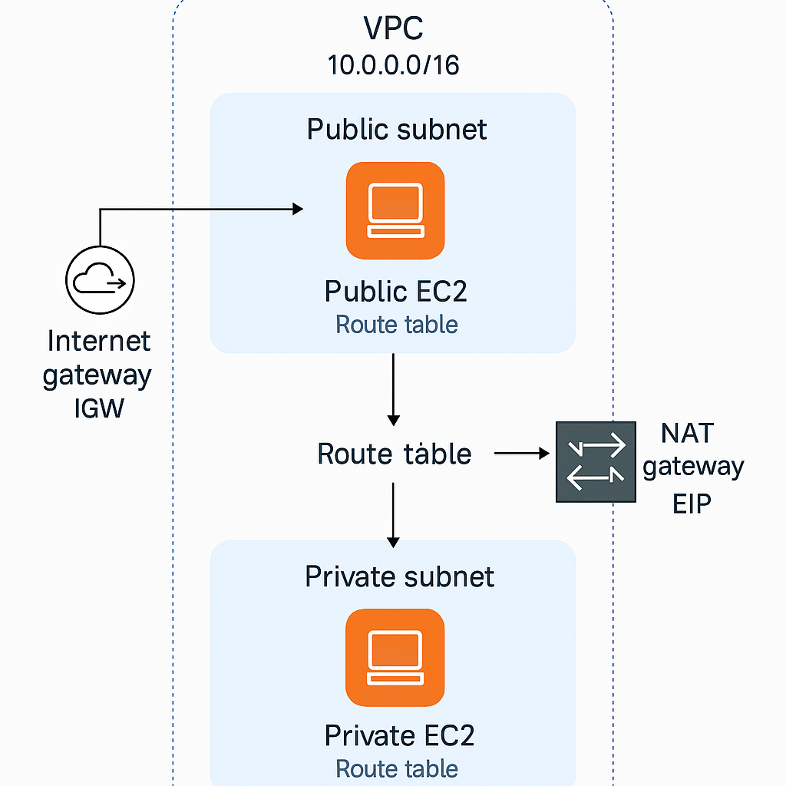

# AWS VPC Project – Public and Private EC2 Instances with NAT Gateway

## Project Objective

This project demonstrates how to create a secure and structured AWS network architecture using:
- A Public EC2 instance with Internet Gateway for direct access
- A Private EC2 instance that accesses the internet via a NAT Gateway
- Route Tables that define traffic behavior for public and private subnets

The main purpose is to understand **how route tables, NAT gateways, and subnet isolation** work in real AWS architectures. This simulates a **real-world use case** where backend servers (like databases or internal APIs) stay private but still need outbound internet access.

---

## Architecture Diagram

---

## Key Components Used

| AWS Service         | Purpose |
|---------------------|---------|
| **VPC**             | Custom virtual network for isolation |
| **Subnets**         | One public & one private |
| **Internet Gateway**| Enables internet access for public subnet |
| **NAT Gateway**     | Allows private subnet instances to access the internet securely |
| **Route Tables**    | Define traffic flow for each subnet |
| **Elastic IP**      | Associated with NAT Gateway |
| **EC2 Instances**   | One in public, one in private subnet |
| **SSM Session Manager** | For connecting to private EC2 without SSH |

---

## Steps Performed

1. **Create a Custom VPC** with CIDR `10.0.0.0/16`

2. **Create Subnets**:
   - Public Subnet: `10.0.1.0/24`
   - Private Subnet: `10.0.2.0/24`
   
3. **Create and Attach Internet Gateway**

4. **Create Route Tables**:
   - Public Route Table with route to IGW
   - Private Route Table with route to NAT Gateway
   
5. **Launch EC2 Instances**:
   - Public EC2 (Amazon Linux) in Public Subnet
   - Private EC2 (Amazon Linux) in Private Subnet with SSM role
   
6. **Create and Associate Elastic IP with NAT Gateway**

7. **Connect and Test**:
   - SSH into Public EC2 and run: `ping google.com`
   - SSM into Private EC2 and run: `curl https://google.com`

---

## Verification

-  Public EC2 has direct internet access via IGW.
-  Private EC2 cannot be SSHed directly.
-  Private EC2 accesses internet via NAT using `curl` command.
-  Route Tables properly control traffic between subnets and internet.

---

## Screenshots to Include

- VPC and Subnet configuration
- Route Tables (public and private)
- NAT Gateway and Elastic IP
- EC2 Instances (with subnet and IP details)
- SSH into Public EC2 + `ping` output
- SSM Session into Private EC2 + `curl` output

---

